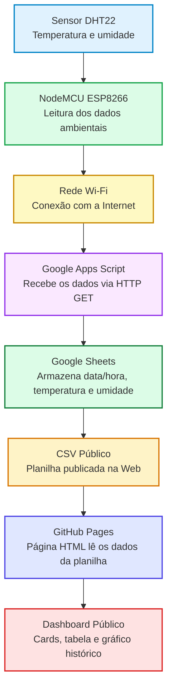

# Projeto NodeMCU: Monitoramento Ambiental com ESP8266, DHT22, Google Sheets e GitHub Pages

Autor: **Prof. Dr. Laerte Peotta de Melo**  
Repositório de referência: `https://github.com/peotta/NodeMCU`

Este documento consolida o material necessário para configurar corretamente o projeto de monitoramento ambiental usando **NodeMCU ESP8266**, **sensor DHT22**, **Google Sheets**, **Google Apps Script** e **GitHub Pages**.

> Observação de segurança: este material utiliza **placeholders** para senha Wi-Fi, tokens e credenciais. Não publique senhas reais, tokens ou informações privadas em repositórios públicos.

---

## 1. Visão Geral do Projeto

O projeto realiza a coleta de **temperatura** e **umidade relativa do ar** por meio de um sensor **DHT22** conectado a uma placa **NodeMCU ESP8266**. Os dados são enviados automaticamente para uma planilha do **Google Sheets** por meio de um **Google Apps Script** publicado como Web App.

A planilha é publicada em formato **CSV**, e uma página em **HTML/CSS/JavaScript**, hospedada no **GitHub Pages**, lê essa planilha e apresenta os dados em formato de **cards**, **gráfico** e **tabela**.

---

## 2. Arquitetura Final



---

## 3. Materiais Necessários

| Item | Quantidade | Finalidade |
| --- | --- | --- |
| NodeMCU ESP8266 | 1   | Microcontrolador com Wi-Fi |
| Sensor DHT22 | 1   | Medição de temperatura e umidade |
| Protoboard | 1   | Montagem do circuito |
| Jumpers macho-macho | Alguns | Conexões elétricas |
| Cabo micro-USB | 1   | Programação e alimentação do NodeMCU |
| Fonte USB 5V | 1   | Alimentação contínua do sistema |
| Resistor de 10 kΩ | 1   | Pull-up entre VCC e DATA, caso o DHT22 seja o sensor de 4 pinos sem módulo |
| Caixa plástica ventilada | 1   | Proteção física do circuito, sem bloquear a ventilação |

---

## 4. Ligações do Circuito

Com o DHT22 visto de frente, a pinagem normalmente é:

```text
VCC | DATA | NC | GND
```

| DHT22 | NodeMCU ESP8266 |
| --- | --- |
| VCC | 3V3 |
| DATA | D4  |
| NC  | Não conectar |
| GND | GND |

Caso o DHT22 seja o sensor de **4 pinos**, recomenda-se usar um resistor de **10 kΩ** entre **VCC** e **DATA**.

```text
3V3 ─── resistor 10 kΩ ─── DATA
```


---

## 5. Configuração da Arduino IDE

### 5.1 Adicionar suporte ao ESP8266

Na Arduino IDE, acessar:

```text
Arquivo → Preferências
```

No campo **URLs adicionais para Gerenciadores de Placas**, adicionar:

```text
http://arduino.esp8266.com/stable/package_esp8266com_index.json
```

Se já existir outra URL, separar com vírgula.

---

### 5.2 Instalar o pacote ESP8266

Acessar:

```text
Ferramentas → Placa → Gerenciador de Placas
```

Pesquisar por:

```text
esp8266
```

Instalar:

```text
esp8266 by ESP8266 Community
```

---

### 5.3 Selecionar a placa correta

Acessar:

```text
Ferramentas → Placa
```

Selecionar:

```text
NodeMCU 1.0 (ESP-12E Module)
```

---

### 5.4 Selecionar a porta

Acessar:

```text
Ferramentas → Porta
```

Selecionar a porta correspondente ao NodeMCU, por exemplo:

```text
COM3
```

---

### 5.5 Configurar o Monitor Serial

Configurar o Monitor Serial em:

```text
9600 baud
```

---

## 6. Bibliotecas Necessárias

Na Arduino IDE, acessar:

```text
Sketch → Incluir Biblioteca → Gerenciar Bibliotecas
```

Instalar:

| Biblioteca | Nome para pesquisa | Finalidade |
| --- | --- | --- |
| DHT sensor library | `DHT sensor library by Adafruit` | Leitura do sensor DHT22 |
| Adafruit Unified Sensor | `Adafruit Unified Sensor` | Dependência da biblioteca DHT |

As bibliotecas abaixo são instaladas com o pacote ESP8266:

| Biblioteca | Finalidade |
| --- | --- |
| `ESP8266WiFi.h` | Conexão Wi-Fi |
| `ESP8266HTTPClient.h` | Requisições HTTP |
| `WiFiClientSecure.h` | Comunicação HTTPS |

---

## 7. Configuração da Planilha Google Sheets

### 7.1 Criar a planilha

Criar uma planilha chamada:

```text
Monitoramento Ambiental - Temperatura e Umidade
```

### 7.2 Configurar a aba

Manter ou renomear a aba para:

```text
Página1
```

> Se o nome da aba for diferente, atualize também o nome no Apps Script.

### 7.3 Criar os cabeçalhos

Na primeira linha da planilha, inserir:

| A   | B   | C   |
| --- | --- | --- |
| Data/Hora | Temperatura | Umidade |

---

## 8. Google Apps Script

Este script recebe os dados enviados pelo ESP8266 via requisição HTTP GET e grava uma nova linha na planilha.

### 8.1 Onde inserir o script

Com a planilha aberta, acessar:

```text
Extensões → Apps Script
```

Apagar o código existente e colar o código abaixo.

---

### 8.2 Código do Google Apps Script

```javascript
/**
 * Projeto: Monitoramento Ambiental IoT
 * Função: Receber dados do ESP8266 e gravar no Google Sheets
 * Autor: Prof. Dr. Laerte Peotta de Melo
 *
 * Parâmetros esperados via HTTP GET:
 * temperatura
 * umidade
 *
 * Exemplo:
 * https://script.google.com/macros/s/SEU_CODIGO/exec?temperatura=27.5&umidade=51.2
 */

function doGet(e) {
  try {
    var ss = SpreadsheetApp.getActiveSpreadsheet();
    var sheet = ss.getSheetByName("Página1");

    if (!sheet) {
      return ContentService.createTextOutput(
        "Erro: aba Página1 não encontrada."
      );
    }

    var temperatura = e.parameter.temperatura;
    var umidade = e.parameter.umidade;

    if (temperatura === undefined || umidade === undefined) {
      return ContentService.createTextOutput(
        "Erro: parâmetros temperatura e umidade são obrigatórios."
      );
    }

    sheet.appendRow([
      new Date(),
      temperatura,
      umidade
    ]);

    return ContentService.createTextOutput(
      "Sucesso: dados recebidos e gravados!"
    );

  } catch (erro) {
    return ContentService.createTextOutput(
      "Erro interno: " + erro.toString()
    );
  }
}
```

---

### 8.3 Implantar o Apps Script como Web App

No Apps Script, acessar:

```text
Implantar → Nova implantação
```

Selecionar:

```text
Tipo → App da Web
```

Configurar:

| Campo | Valor |
| --- | --- |
| Executar como | Eu  |
| Quem tem acesso | Qualquer pessoa |

Clicar em:

```text
Implantar
```

Autorizar o acesso quando solicitado.

Ao final, copiar a URL gerada, no formato:

```text
https://script.google.com/macros/s/SEU_CODIGO/exec
```

---

### 8.4 Atualizar implantação após mudanças

Sempre que alterar o Apps Script, publicar uma nova versão:

```text
Implantar → Gerenciar implantações → Editar → Nova versão → Implantar
```

---

## 9. Teste Manual do Apps Script

Antes de usar o ESP8266, testar pelo navegador:

```text
https://script.google.com/macros/s/SEU_CODIGO/exec?temperatura=27.5&umidade=51.2
```

Resultado esperado no navegador:

```text
Sucesso: dados recebidos e gravados!
```

Resultado esperado na planilha:

| Data/Hora | Temperatura | Umidade |
| --- | --- | --- |
| Data e hora atual | 27.5 | 51.2 |

---

## 10. Código Final do Projeto para o NodeMCU ESP8266

Criar um arquivo na Arduino IDE chamado:

```text
monitoramento_ambiental_google_sheets.ino
```

Colar o código abaixo.

> Antes de carregar para a placa, substituir `NOME_DA_REDE_WIFI`, `SENHA_DA_REDE_WIFI` e `URL_DO_SEU_APPS_SCRIPT`.

```cpp
/*************************************************************
  Projeto: Monitoramento de Temperatura e Umidade
  Placa: NodeMCU ESP8266
  Sensor: DHT22
  Plataforma: Google Sheets via Google Apps Script

  Autor: Prof. Dr. Laerte Peotta de Melo
*************************************************************/

/* Bibliotecas */
#include <ESP8266WiFi.h>
#include <ESP8266HTTPClient.h>
#include <WiFiClientSecure.h>
#include <DHT.h>

/* Dados da rede Wi-Fi */
char ssid[] = "NOME_DA_REDE_WIFI";
char pass[] = "SENHA_DA_REDE_WIFI";

/* URL do Google Apps Script */
const char* GOOGLE_SCRIPT_URL = "URL_DO_SEU_APPS_SCRIPT";

/* Configuração do sensor DHT22 */
#define DHTPIN D4
#define DHTTYPE DHT22

DHT dht(DHTPIN, DHTTYPE);

/* Intervalo entre medições */
unsigned long intervaloEnvio = 300000; // 5 minutos
unsigned long tempoAnterior = 0;

/* Função para conectar ao Wi-Fi */
void conectarWiFi()
{
  Serial.println();
  Serial.print("Conectando ao Wi-Fi: ");
  Serial.println(ssid);

  WiFi.begin(ssid, pass);

  int tentativas = 0;

  while (WiFi.status() != WL_CONNECTED && tentativas < 30) {
    delay(500);
    Serial.print(".");
    tentativas++;
  }

  Serial.println();

  if (WiFi.status() == WL_CONNECTED) {
    Serial.println("Wi-Fi conectado com sucesso.");
    Serial.print("Endereço IP: ");
    Serial.println(WiFi.localIP());
  } else {
    Serial.println("Falha ao conectar ao Wi-Fi.");
  }
}

/* Função para enviar os dados ao Google Sheets */
void enviarParaGoogleSheets(float temperatura, float umidade)
{
  if (WiFi.status() != WL_CONNECTED) {
    Serial.println("Wi-Fi desconectado. Tentando reconectar...");
    conectarWiFi();
  }

  if (WiFi.status() == WL_CONNECTED) {
    WiFiClientSecure client;
    client.setInsecure();

    HTTPClient http;

    String url = String(GOOGLE_SCRIPT_URL);
    url += "?temperatura=" + String(temperatura, 2);
    url += "&umidade=" + String(umidade, 2);

    Serial.println("Enviando dados para o Google Sheets...");
    Serial.println(url);

    http.begin(client, url);
    http.setFollowRedirects(HTTPC_STRICT_FOLLOW_REDIRECTS);

    int httpCode = http.GET();

    if (httpCode > 0) {
      String resposta = http.getString();

      Serial.print("Código HTTP: ");
      Serial.println(httpCode);

      Serial.print("Resposta Google Sheets: ");
      Serial.println(resposta);
    } else {
      Serial.print("Erro ao enviar para Google Sheets. Código: ");
      Serial.println(httpCode);
    }

    http.end();
  } else {
    Serial.println("Não foi possível enviar. Wi-Fi continua desconectado.");
  }
}

/* Função para ler o sensor */
void lerEEnviarDados()
{
  float umidade = dht.readHumidity();
  float temperatura = dht.readTemperature();

  if (isnan(umidade) || isnan(temperatura)) {
    Serial.println("Erro ao ler o sensor DHT22!");
    return;
  }

  Serial.print("Temperatura: ");
  Serial.print(temperatura);
  Serial.print(" °C | Umidade: ");
  Serial.print(umidade);
  Serial.println(" %");

  enviarParaGoogleSheets(temperatura, umidade);
}

void setup()
{
  Serial.begin(9600);
  delay(1000);

  Serial.println();
  Serial.println("Iniciando sistema de monitoramento ambiental...");

  dht.begin();

  /*
    Aguarda o DHT22 estabilizar após energizar.
    Isso ajuda a evitar erro na primeira leitura.
  */
  delay(3000);

  conectarWiFi();

  /*
    Primeira leitura após estabilização do sensor
    e tentativa de conexão Wi-Fi.
  */
  lerEEnviarDados();

  tempoAnterior = millis();
}

void loop()
{
  unsigned long tempoAtual = millis();

  if (tempoAtual - tempoAnterior >= intervaloEnvio) {
    tempoAnterior = tempoAtual;
    lerEEnviarDados();
  }
}
```

---

## 11. Configurações que Devem Ser Alteradas no Código Arduino

### 11.1 Rede Wi-Fi

Substituir:

```cpp
char ssid[] = "NOME_DA_REDE_WIFI";
char pass[] = "SENHA_DA_REDE_WIFI";
```

Por sua rede Wi-Fi real.

> O ESP8266 utiliza Wi-Fi **2.4 GHz**. Ele não se conecta a redes exclusivamente 5 GHz.

---

### 11.2 URL do Apps Script

Substituir:

```cpp
const char* GOOGLE_SCRIPT_URL = "URL_DO_SEU_APPS_SCRIPT";
```

Pela URL gerada no Apps Script:

```cpp
const char* GOOGLE_SCRIPT_URL = "https://script.google.com/macros/s/SEU_CODIGO/exec";
```

---

### 11.3 Intervalo de envio

Para envio a cada 5 minutos:

```cpp
unsigned long intervaloEnvio = 300000;
```

Para teste rápido, pode-se usar 10 segundos:

```cpp
unsigned long intervaloEnvio = 10000;
```

Depois dos testes, retornar para:

```cpp
unsigned long intervaloEnvio = 300000;
```

---

## 12. Publicar a Planilha como CSV

Para o HTML do GitHub Pages ler os dados, a planilha precisa ser publicada como CSV.

Na planilha Google, acessar:

```text
Arquivo → Compartilhar → Publicar na Web
```

Selecionar:

| Campo | Valor |
| --- | --- |
| Aba | Página1 |
| Formato | Valores separados por vírgula (.csv) |

Clicar em:

```text
Publicar
```

Copiar o link gerado, que deve ter formato semelhante a:

```text
https://docs.google.com/spreadsheets/d/e/SEU_CODIGO_PUBLICADO/pub?gid=0&single=true&output=csv
```

---

## 13. HTML Final para GitHub Pages

Criar um arquivo chamado:

```text
index.html
```

No repositório GitHub.

Substituir `LINK_CSV_DA_PLANILHA` pelo link CSV publicado da planilha.

```html
<!DOCTYPE html>
<html lang="pt-BR">
<head>
  <meta charset="UTF-8" />
  <meta name="viewport" content="width=device-width, initial-scale=1.0" />

  <title>Monitoramento Ambiental IoT</title>

  <script src="https://cdn.jsdelivr.net/npm/chart.js"></script>

  <style>
    :root {
      --bg: #0f172a;
      --card: #111827;
      --text: #f8fafc;
      --muted: #94a3b8;
      --temp: #f97316;
      --hum: #38bdf8;
      --ok: #22c55e;
      --border: rgba(255, 255, 255, 0.08);
    }

    * {
      box-sizing: border-box;
      margin: 0;
      padding: 0;
      font-family: Arial, Helvetica, sans-serif;
    }

    body {
      background: radial-gradient(circle at top, #1e293b, var(--bg));
      color: var(--text);
      min-height: 100vh;
      padding: 32px;
    }

    header {
      text-align: center;
      margin-bottom: 32px;
    }

    header h1 {
      font-size: 2.4rem;
      margin-bottom: 10px;
    }

    header p {
      color: var(--muted);
      font-size: 1rem;
    }

    .container {
      max-width: 1200px;
      margin: auto;
    }

    .erro {
      display: none;
      background: rgba(239, 68, 68, 0.18);
      border: 1px solid rgba(239, 68, 68, 0.5);
      color: #fecaca;
      padding: 16px;
      border-radius: 14px;
      margin-bottom: 22px;
    }

    .cards {
      display: grid;
      grid-template-columns: repeat(auto-fit, minmax(220px, 1fr));
      gap: 20px;
      margin-bottom: 28px;
    }

    .card {
      background: rgba(17, 24, 39, 0.9);
      border: 1px solid var(--border);
      border-radius: 20px;
      padding: 24px;
      box-shadow: 0 20px 50px rgba(0, 0, 0, 0.35);
    }

    .card h2 {
      color: var(--muted);
      font-size: 0.95rem;
      margin-bottom: 12px;
      font-weight: 500;
    }

    .value {
      font-size: 2.1rem;
      font-weight: bold;
    }

    .temp {
      color: var(--temp);
    }

    .hum {
      color: var(--hum);
    }

    .ok {
      color: var(--ok);
    }

    .chart-card {
      background: rgba(17, 24, 39, 0.9);
      border: 1px solid var(--border);
      border-radius: 20px;
      padding: 24px;
      margin-bottom: 28px;
      box-shadow: 0 20px 50px rgba(0, 0, 0, 0.35);
    }

    .chart-card h2 {
      margin-bottom: 20px;
      font-size: 1.2rem;
    }

    .chart-container {
      position: relative;
      height: 430px;
      width: 100%;
    }

    canvas {
      width: 100% !important;
      height: 100% !important;
    }

    table {
      width: 100%;
      border-collapse: collapse;
      background: rgba(17, 24, 39, 0.9);
      border-radius: 20px;
      overflow: hidden;
      border: 1px solid var(--border);
    }

    th, td {
      padding: 14px;
      border-bottom: 1px solid var(--border);
      text-align: left;
    }

    th {
      background: rgba(30, 41, 59, 0.9);
      color: var(--text);
    }

    td {
      color: #cbd5e1;
    }

    footer {
      text-align: center;
      color: var(--muted);
      margin-top: 32px;
      font-size: 0.9rem;
    }

    @media (max-width: 700px) {
      body {
        padding: 18px;
      }

      header h1 {
        font-size: 1.8rem;
      }

      .value {
        font-size: 1.7rem;
      }

      .chart-container {
        height: 360px;
      }

      th, td {
        padding: 10px;
        font-size: 0.9rem;
      }
    }
  </style>
</head>

<body>

  <header>
    <h1>Monitoramento Ambiental IoT</h1>
    <p>Temperatura e umidade coletadas com NodeMCU ESP8266 e sensor DHT22</p>
  </header>

  <main class="container">

    <div id="erro" class="erro">
      Não foi possível carregar os dados da planilha. Verifique se a planilha continua publicada como CSV.
    </div>

    <section class="cards">
      <div class="card">
        <h2>Temperatura Atual</h2>
        <div id="temperaturaAtual" class="value temp">-- °C</div>
      </div>

      <div class="card">
        <h2>Umidade Atual</h2>
        <div id="umidadeAtual" class="value hum">-- %</div>
      </div>

      <div class="card">
        <h2>Última Atualização</h2>
        <div id="ultimaAtualizacao" class="value">--</div>
      </div>

      <div class="card">
        <h2>Total de Registros</h2>
        <div id="totalRegistros" class="value ok">--</div>
      </div>
    </section>

    <section class="chart-card">
      <h2>Histórico de Temperatura e Umidade</h2>
      <div class="chart-container">
        <canvas id="graficoAmbiental"></canvas>
      </div>
    </section>

    <section class="chart-card">
      <h2>Últimas Medições</h2>
      <table>
        <thead>
          <tr>
            <th>Data/Hora</th>
            <th>Temperatura</th>
            <th>Umidade</th>
          </tr>
        </thead>
        <tbody id="tabelaDados"></tbody>
      </table>
    </section>

  </main>

  <footer>
    Projeto desenvolvido por Prof. Dr. Laerte Peotta de Melo
  </footer>

  <script>
    const PLANILHA_CSV_URL = "LINK_CSV_DA_PLANILHA";

    let grafico = null;

    async function carregarDados() {
      try {
        const resposta = await fetch(PLANILHA_CSV_URL);

        if (!resposta.ok) {
          throw new Error("Erro ao acessar a planilha.");
        }

        const csv = await resposta.text();

        const linhas = csv
          .trim()
          .split("\n")
          .map(linha => linha.split(","));

        const dados = linhas.slice(1).map(linha => {
          return {
            dataHora: limparTexto(linha[0]),
            temperatura: converterNumero(linha[1]),
            umidade: converterNumero(linha[2])
          };
        }).filter(item =>
          item.dataHora &&
          !isNaN(item.temperatura) &&
          !isNaN(item.umidade)
        );

        if (dados.length === 0) {
          throw new Error("Nenhum dado válido encontrado.");
        }

        atualizarCards(dados);
        atualizarGrafico(dados);
        atualizarTabela(dados);

        document.getElementById("erro").style.display = "none";

      } catch (erro) {
        console.error("Erro ao carregar dados:", erro);
        document.getElementById("erro").style.display = "block";
      }
    }

    function limparTexto(valor) {
      if (!valor) return "";
      return valor.replace(/"/g, "").trim();
    }

    function converterNumero(valor) {
      if (!valor) return NaN;

      return parseFloat(
        valor
          .replace(/"/g, "")
          .replace(",", ".")
          .trim()
      );
    }

    function atualizarCards(dados) {
      const ultimo = dados[dados.length - 1];

      document.getElementById("temperaturaAtual").textContent =
        ultimo.temperatura.toFixed(2) + " °C";

      document.getElementById("umidadeAtual").textContent =
        ultimo.umidade.toFixed(2) + " %";

      document.getElementById("ultimaAtualizacao").textContent =
        ultimo.dataHora;

      document.getElementById("totalRegistros").textContent =
        dados.length;
    }

    function atualizarGrafico(dados) {
      const ultimos = dados.slice(-50);

      const labels = ultimos.map(item => item.dataHora);
      const temperaturas = ultimos.map(item => item.temperatura);
      const umidades = ultimos.map(item => item.umidade);

      const ctx = document.getElementById("graficoAmbiental").getContext("2d");

      if (grafico) {
        grafico.destroy();
      }

      grafico = new Chart(ctx, {
        type: "line",
        data: {
          labels: labels,
          datasets: [
            {
              label: "Temperatura (°C)",
              data: temperaturas,
              borderColor: "#f97316",
              backgroundColor: "rgba(249, 115, 22, 0.15)",
              fill: true,
              tension: 0.35,
              pointRadius: 3,
              pointHoverRadius: 5
            },
            {
              label: "Umidade (%)",
              data: umidades,
              borderColor: "#38bdf8",
              backgroundColor: "rgba(56, 189, 248, 0.15)",
              fill: true,
              tension: 0.35,
              pointRadius: 3,
              pointHoverRadius: 5
            }
          ]
        },
        options: {
          responsive: true,
          maintainAspectRatio: false,
          interaction: {
            mode: "index",
            intersect: false
          },
          plugins: {
            legend: {
              labels: {
                color: "#f8fafc"
              }
            },
            tooltip: {
              mode: "index",
              intersect: false
            }
          },
          scales: {
            x: {
              ticks: {
                color: "#94a3b8",
                maxRotation: 45,
                minRotation: 45
              },
              grid: {
                color: "rgba(255,255,255,0.08)"
              }
            },
            y: {
              ticks: {
                color: "#94a3b8"
              },
              grid: {
                color: "rgba(255,255,255,0.08)"
              }
            }
          }
        }
      });
    }

    function atualizarTabela(dados) {
      const tabela = document.getElementById("tabelaDados");
      tabela.innerHTML = "";

      dados.slice(-10).reverse().forEach(item => {
        const linha = document.createElement("tr");

        linha.innerHTML = `
          <td>${item.dataHora}</td>
          <td>${item.temperatura.toFixed(2)} °C</td>
          <td>${item.umidade.toFixed(2)} %</td>
        `;

        tabela.appendChild(linha);
      });
    }

    carregarDados();

    setInterval(carregarDados, 300000);
  </script>

</body>
</html>
```

---

## 14. Estrutura Recomendada do Repositório

```text
NodeMCU/
├── README.md
├── index.html
├── src/
│   └── monitoramento_ambiental_google_sheets.ino
├── scripts/
│   └── google-apps-script.js
├── docs/
│   └── configuracao-projeto.md
└── imagens/
    ├── circuito.png
    ├── montagem-real.jpg
    └── dashboard.png
```

---

## 15. Configuração do GitHub Pages

No repositório, acessar:

```text
Settings → Pages
```

Configurar:

| Campo | Valor |
| --- | --- |
| Source | Deploy from a branch |
| Branch | main |
| Folder | /root |

Após salvar, o site será publicado em um endereço semelhante a:

```text
https://peotta.github.io/NodeMCU/
```

---

## 16. Checklist Final

### Hardware

- [ ] DHT22 ligado em 3V3.
- [ ] DATA do DHT22 ligado em D4.
- [ ] GND do DHT22 ligado em GND.
- [ ] Resistor de 10 kΩ entre VCC e DATA, se necessário.
- [ ] NodeMCU alimentado por USB ou fonte 5V.

### Arduino IDE

- [ ] Pacote ESP8266 instalado.
- [ ] Placa NodeMCU 1.0 selecionada.
- [ ] Porta correta selecionada.
- [ ] Biblioteca DHT instalada.
- [ ] Biblioteca Adafruit Unified Sensor instalada.
- [ ] Código carregado na placa.

### Google Sheets

- [ ] Planilha criada.
- [ ] Aba chamada Página1.
- [ ] Cabeçalhos criados.
- [ ] Apps Script implantado como Web App.
- [ ] Apps Script configurado para acesso público.
- [ ] Planilha recebendo dados.

### GitHub Pages

- [ ] Planilha publicada como CSV.
- [ ] Link CSV inserido no HTML.
- [ ] Arquivo index.html criado.
- [ ] GitHub Pages ativado.
- [ ] Dashboard carregando dados.

---

## 17. Testes Esperados

### Monitor Serial

Com o Monitor Serial em 9600 baud, as mensagens esperadas são:

```text
Iniciando sistema de monitoramento ambiental...
Conectando ao Wi-Fi...
Wi-Fi conectado com sucesso.
Temperatura: 27.00 °C | Umidade: 50.80 %
Enviando dados para o Google Sheets...
Código HTTP: 200
Resposta Google Sheets: Sucesso: dados recebidos e gravados!
```

### Planilha

A planilha deve receber linhas no formato:

| Data/Hora | Temperatura | Umidade |
| --- | --- | --- |
| data e hora automática | 27.00 | 50.80 |

### Site

O GitHub Pages deve apresentar:

- temperatura atual;
- umidade atual;
- última atualização;
- total de registros;
- gráfico de temperatura e umidade;
- tabela com as últimas medições.

---

## 18. Cuidados de Segurança

Não publicar:

- senha real do Wi-Fi;
- tokens privados;
- credenciais pessoais;
- dados sensíveis de rede.

Usar placeholders no código público:

```cpp
char ssid[] = "NOME_DA_REDE_WIFI";
char pass[] = "SENHA_DA_REDE_WIFI";
const char* GOOGLE_SCRIPT_URL = "URL_DO_SEU_APPS_SCRIPT";
```

---

## 19. Conclusão

Com esta configuração, o projeto deixa de depender de uma plataforma IoT fechada para visualização pública. O **ESP8266** envia automaticamente os dados para o **Google Sheets**, e o **GitHub Pages** apresenta uma interface pública com gráfico e tabela, permitindo que qualquer pessoa consulte as medições de temperatura e umidade pela web.
